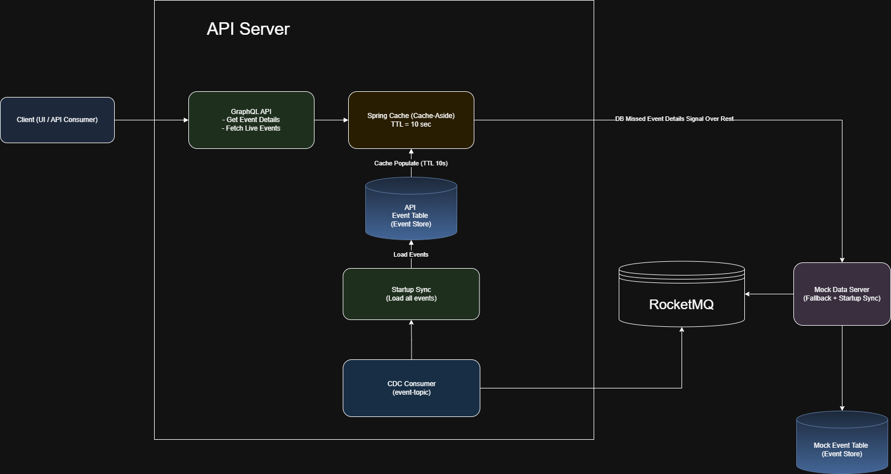
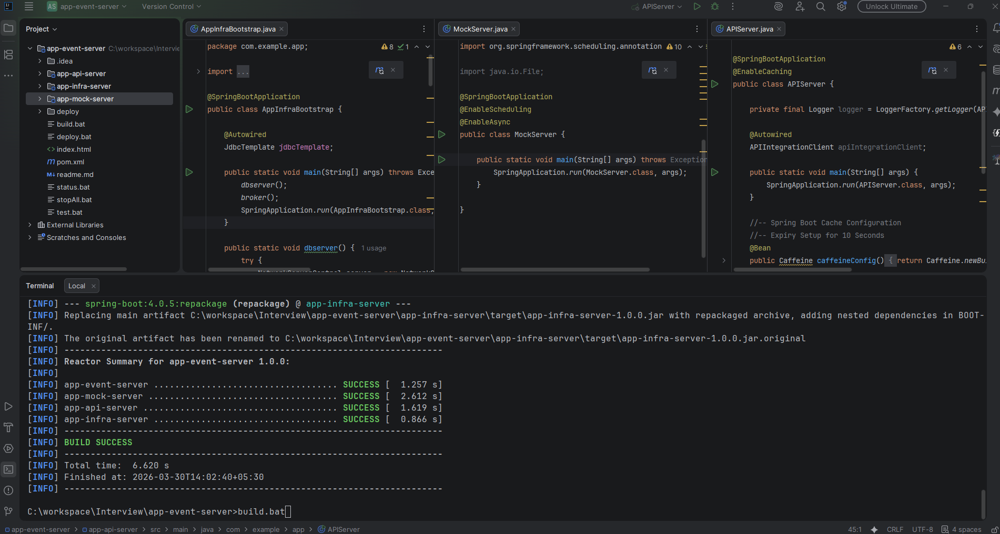

## Build and Deploy Instructions [Sequence]

### Checkout main branch
- git clone -b main git@github.com:manojchaudhari20202-code/app-event-server.git
- OR Donwload ::: https://github.com/manojchaudhari20202-code/app-event-server/archive/refs/heads/main.zip

### Test
mvn clean test surefire-report:report-only -Dmaven.test.failure.ignore=true

### Build
mvn clean package -DskipTests

### Start Infra Server
- cd app-infra-server 
- mvn exec:java -Dexec.mainClass="com.example.app.AppInfraBootstrap"
- DB GUI URL ::: http://localhost:8081/
- Health URL ::: http://localhost:8081/actuator/health

### Start Mock Server
- cd app-mock-server 
- mvn exec:java -Dexec.mainClass="com.example.app.MockServer"
- GraphQL GUI URL ::: http://localhost:8080/graphiql
- Health URL ::: http://localhost:8080/actuator/health

### Start API Server
- cd app-api-server 
- mvn exec:java -Dexec.mainClass="com.example.app.APIServer"
- Mock Swagger URL ::: http://localhost:9090/swagger-ui/index.html](http://localhost:9090/swagger-ui/index.html
- Health URL ::: http://localhost:9090/actuator/health

--- 

# Event API Server Application

## Architecture Overview


### API Server
The API Server acts as the central access layer for clients and manages caching, persistence, and fallback strategies.

**GraphQL Endpoints**
- Fetch event details
- Retrieve all live events
- Startup Synchronization**
- On application startup, all events are synced from the Mock Data Server into the local database.

**Caching Strategy (Cache-Aside / Lazy Loading)**
- Uses Spring Cache (Caffeine)
- TTL: **10 seconds**
- Flow:
    1. Check cache
    2. On miss → fetch from DB
    3. Populate cache (TTL = 10s)

* **Fallback Mechanism**
    * If event not found in DB:
        * Make REST call to Mock Data Server
        * Persist response in DB
        * Update cache

**CDC (Change Data Capture) Consumer**
- Continuously consumes events from `event-topic`
- Updates local database in near real-time

---

### Infra Server

Responsible for infrastructure initialization and environment setup.
* Start **Apache Derby Network Server**
* Drop and recreate all tables (clean state)
* Clean **RocketMQ message store directory**
* Start **Apache RocketMQ Broker**

---

### Mock Data Server
Simulates external event provider and drives system behavior.
* **REST APIs**
    * Get event by ID
    * Fetch all live events
* **Scheduled Jobs**
    * Mark live events as inactive periodically
    * Insert new mock events
* **Event Publishing**
    * Immediately publishes event updates to MQ
* **Async Messaging Flow**
  ```
  request → mock-topic → listener → event-topic
  ```
---
## End-to-End Data Flow
1. Client calls GraphQL API
2. API checks cache
3. Cache miss → DB lookup
4. DB miss → REST call to Mock Server
5. Cache updated and Mock Server sends data to event-topic
6. CDC consumer continuously updates DB from MQ 
7. Response saved in DB 
7. Cache refreshes on next request (TTL expiry)

---
## Data Model

### API_EVENT_DETAILS and MOCK_EVENT_DETAILS [EVENT_ID GENERATE]

| Column Name  | Type      | Description             |
| ------------ | --------- | ----------------------- |
| EVENT_ID     | INT       | Unique event identifier |
| EVENT_STATUS | BOOLEAN   | Live / inactive status  |
| EVENT_SCORE  | STRING    | Event score/details     |
| CREATED_TS   | TIMESTAMP | Creation timestamp      |
| UPDATED_TS   | TIMESTAMP | Last update timestamp   |

---

## Implementation

### Modules
#### 1. app-infra-server
* Starts Apache Derby DB
* Drops & recreates schema
* Starts RocketMQ broker
* Cleans message store
#### 2. app-api-server
* GraphQL API layer
* Cache management (Spring Cache)
* DB interaction
* CDC consumer integration
#### 3. app-mock-server
* Mock REST APIs
* Event simulation (scheduler)
* MQ publisher

---

## Frameworks & Tools
* **Java + Spring Boot**
* **Spring GraphQL**
* **Spring Cache (Caffeine)**
* **Apache Derby (Network DB)**
* **Apache RocketMQ (Network Server)**
* **Actuator + Micrometer (Monitoring)**

---

## Non-Functional Considerations (Added)

### Scalability

* Stateless API layer → horizontally scalable
* Cache reduces DB load
* MQ decouples producers/consumers

### Consistency

* Eventual consistency via CDC
* Cache TTL ensures freshness balance

### Performance

* Cache-first strategy (10s TTL)
* Async MQ updates

### Fault Tolerance

* Fallback to Mock Server
* Retry mechanisms for MQ consumption

---

## Design Patterns Used
* Cache-Aside Pattern
* Event-Driven Architecture
* CQRS-lite (read via cache, write via CDC)
* Retry + Fallback Pattern

---

# Dev Setup


